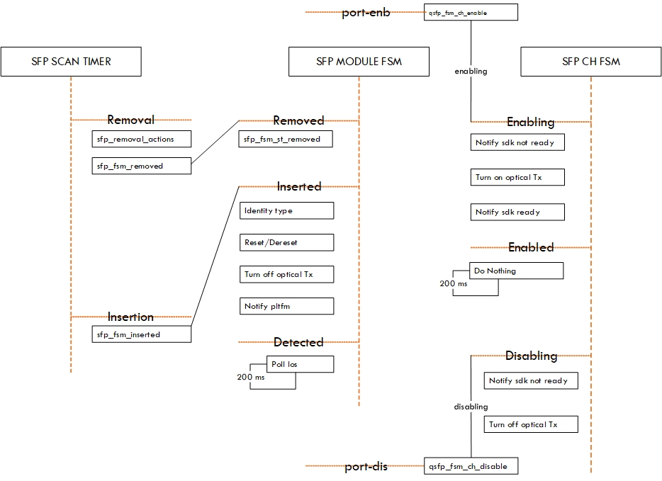

Table of Contents
- [About This Repository](#about-this-repository)
- [About the Compatibilities to SDE](#about-the-compatibilities-to-sde)
- [Special Dependency](#special-dependency)
- [Quick Start](#quick-start)
  - [Environment Variables](#environment-variables)
  - [Build BSP](#build-bsp)
    - [Clone repo](#clone-repo)
    - [Build BSP via CMake](#build-bsp-via-cmake)
  - [Launch](#launch)
    - [Generate Launching Variables](#generate-launching-variables)
    - [Launch X-T Platforms](#launch-x-t-platforms)
    - [Launch X-T Platforms (Tofino2 based)](#launch-x-t-platforms-tofino2-based)
    - [Neccessary changes to SDE for tof2 based X-T](#neccessary-changes-to-sde-for-tof2-based-x-t)
- [State Machine](#state-machine)
- [Q\&A](#qa)

## <a name="about-this-repository"></a>About This Repository

Mainline  **ALL-in-ONE** repository for all Intel Tofino based **X-T Programmable Bare Metal Switch** powered by Asterfusion with Long Term Support.

Current supported **X-T Programmable Bare Metal Switch**:
  - `X308P-T`,  08x 100GbE QSFP28, 48x 25GbE SFP28 and last 4 of them can be configured as 1GbE. *PTP* is an option.
  - `X564P-T`,  64x 100GbE QSFP28, and auxiliary 2x 25GbE SFP28 which can be configured as 1GbE.
  - `X532P-T`,  32x 100GbE QSFP28, and auxiliary 2x 25GbE SFP28 which can be configured as 1GbE.
  - `X732Q-T`,  32x 400GbE QSFP56-DD, and auxiliary 2x 25GbE SFP28 which can be configured as 1GbE. *PTP* is an option.
  - `X312P-T`,  12x 100GbE QSFP28, 48x 25GbE SFP28, and auxiliary 2x 25GbE SFP28 which can be configured as 1GbE.


__Figure 1: X-T Programmable Bare Metal Switch Family__

Sometimes, we call `X564P-T` and `X532P-T` as `X5-T`, and call `X312P-T` and `X308P-T` as `X3-T`.

## <a name="about-the-compatibilities-to-sde"></a>About the Compatibilities to SDE

Current supported **SDE**:

  - `8.9.x`.
  - `9.1.x`.
  - `9.3.x`.
  - `9.5.x`.
  - `9.7.x`.
  - `9.9.x`.
  - `9.11.x`.
  - `9.13.x (recommended for X732Q-T)`.

The version number of a SDE consists of three Arabic numbers, `x.y.z`, where `x` is the major version, `y` is the minor version, and `z` is the sub-version under `y`.
It's would be a LTS version when `y` is odd, otherwise it is a non-LTS version. It's worth mentioning that we build and run the code on the top of Debian and here only list the versions which we have adapted and tested, and this does not exclude or deny that the repository does not support other non-LTS SDE versions.

Disclaimer: The SDE for the Intel Tofino series of P4-programmable ASICs is currently only available under NDA from Intel. The users of this repository are assumed to be authorized to download and use the SDE. And also, we assume the users have built SDE successfully before working with this repository. `Even though you may have heard that the SDE nowadays is an opened source on github/p4lang/open-p4studio, the ODMs, including Asterfusion at least, are not explicitly authorized to provide the SDE gotten from Intel, to end users.`

免责声明: 英特尔Tofino P4可编程芯片的SDE需签署NDA协议获取。使用本仓库前，请确保您已获授权并完成SDE构建。`尽管您可能听说SDE已在github/p4lang/open-p4studio开源，但ODM厂商（至少包括Asterfusion）未被明确授权可向终端用户提供、分发、转售由英特尔官方提供的SDE.`

## <a name="special-dependency"></a>Special Dependency

The full special dependencies are required to be compiled and installed before starting this repository:

  - `nct6779d`, which only required by `X312P-T`.
  - `cgoslx`, which required by `X5-T` (earlier HW).

The `X-T Programmable Bare Metal` user manual, in Chapter 10.26.1, describes where to find and how to install them from source.

## <a name="quick-start"></a>Quick Start

### <a name="environment-variables"></a>Environment Variables
Intel Tofino SDK Variables

*x and y are appropriate values to fit your SDE.*
```bash
root@localhost:~# vi ~/.bashrc
export SDE=/root/bf-sde-9.x.y
export SDE_INSTALL=$SDE/install
export PATH=$PATH:$SDE_INSTALL/bin
export LD_LIBRARY_PATH=$LD_LIBRARY_PATH:$SDE_INSTALL/lib
root@localhost:# source ~/.bashrc
```

### <a name="build-bsp"></a>Build BSP

#### <a name="clone-repo"></a>Clone repo

```bash
root@localhost:~# git clone https://github.com/asterfusion/bf-bsp-lts.git
root@localhost:~# cd bf-bsp-lts
root@localhost:~/bf-bsp-lts#
```


#### <a name="build-bsp-via-cmake"></a>Build BSP via CMake
The proccedure of building bsp by cmake is texted below:
```bash
root@localhost:~/bf-bsp-lts# ./autogen.sh
root@localhost:~/bf-bsp-lts# mkdir build && cd build/
root@localhost:~/bf-bsp-lts/build# cmake .. -DCMAKE_MODULE_PATH=`pwd`/../cmake  \
                                            -DCMAKE_INSTALL_PREFIX=$SDE_INSTALL \
                                            -DOS_NAME=Debian                    \
                                            -DOS_VERSION=9                      \
                                            -DSDE_VERSION=9133
root@localhost:~/bf-bsp-lts/build# make -j15 install
```

Finally, `libasterfusionbf*`, `libplatform_thrift*`, `libpltfm_driver*`, `libpltfm_mgr*` will be installed to `$SDE_INSTALL/lib`, and all headers exposed by bsp will be installed to `$SDE_INSTALL/include`.

In `$BSP/drivers/include/bf_pltfm_types/bf_pltfm_type.h` defines `SDE_VERSION` and `OS_VERSION` to have a better compatible to different SDEs. The default supported variables, which are  `OS_NAME=Debian`, `OS_VERSION=9`, `SDE_VERSION=9133`, `THRIFT-DRIVER=on`, `LASER_ON=off·， will be applied if none of them are passed via CMake CLI.

If you are going to use different OS, this recommended **OS** list would help:

  - Debian `(9|10|11|12)`.
  - Ubuntu `(18.04|20.04|22.04)`.

Taking Ubuntu 22.04 and SDE 9.13.4 as example, the options pass to CMake are like below:
```bash
root@localhost:~/bf-bsp-lts/build# cmake .. -DCMAKE_MODULE_PATH=`pwd`/../cmake  \
                                            -DCMAKE_INSTALL_PREFIX=$SDE_INSTALL \
                                            -DOS_NAME=Ubuntu                    \
                                            -DOS_VERSION=2204                   \
                                            -DSDE_VERSION=9134
```

### <a name="launch"></a>Launch

#### <a name="generate-launching-variables"></a>Generate Launching Variables

BSP requires a set of variable entries before launch. Those entries are generated by `xt-cfgen.sh` and written to `/etc/platform.conf`.

```bash
root@localhost:~# xt-cfgen.sh
Notice: Start detecting and make sure that the switchd is not running
Loading bf_kdrv ...
...
It looks like x532p-t detected.
...
Generate /etc/platform.conf
Done
...
```
*xt-cfgen.sh will do 2 things: 1) Load all required kernel drivers, including bf_kdrv and i2c_kdrv; 2) Generate /etc/platform.conf which required by bsp. If /etc/platform.conf already existed, xt-cfgen.sh will skip generate it but only load required kernel drivers. It is recommended to run xt-cfgen.sh at least once after every boot.*

#### <a name="launch-x-t-platforms"></a>Launch X-T Platforms
A p4 prog named `diags.p4` is intergrated by default, you can launch it freely.

```bash
root@localhost:~# run_switchd.sh -p diag
Using SDE /usr/local/sde/bf-sde-9.x.y
Using SDE_INSTALL /usr/local/sde
Setting up DMA Memory Pool
Using TARGET_CONFIG_FILE /usr/local/sde/share/p4/targets/tofino/diag.conf
...
```

#### <a name="launch-x-t-platforms-tofino2-based"></a>Launch X-T Platforms (Tofino2 based)
```bash
root@localhost:~# run_switchd.sh -p diag --arch tf2
...
Using TARGET_CONFIG_FILE /usr/local/sde/share/p4/targets/tofino2/diag.conf
...
```
*For Third-party integration, please copy $BSP/platforms/asterfusion-bf/src/platform_mgr/pltfm_bd_map_xxx.json to your $SDE_INSTALL/share/platforms/board-maps/asterfusion/ before running.*

#### <a name="neccessary-changes-to-sde-for-tof2-based-x-t"></a>Neccessary changes to SDE for tof2 based X-T

If you're running tofino2 based X-T Programmable Bare Metal and facing link issue with modules, please try to have this patch appiled to your SDE (recommended for SDE *9.13.x*), which will significantly improve link stability.
```bash
diff --git a/pkgsrc/bf-drivers/src/bf_pm/port_fsm/tof2_fsm/bf_pm_fsm_dfe.c b/pkgsrc/bf-drivers/src/bf_pm/port_fsm/tof2_fsm/bf_pm_fsm_dfe.c
index a66d0e8d..79f65cc5 100644
--- a/pkgsrc/bf-drivers/src/bf_pm/port_fsm/tof2_fsm/bf_pm_fsm_dfe.c
+++ b/pkgsrc/bf-drivers/src/bf_pm/port_fsm/tof2_fsm/bf_pm_fsm_dfe.c
@@ -228,12 +228,12 @@ static bf_status_t bf_pm_fsm_wait_rx_signal(bf_dev_id_t dev_id,
     if (rc != BF_SUCCESS) return BF_INVALID_ARG;
     if (!sig_detect || !phy_ready) return BF_NOT_READY;
   }
-
+#if 0
   /* reset serdes to force re-adapt */
   for (ln = 0; ln < num_lanes; ln++) {
     bf_tof2_serdes_lane_reset_set(dev_id, dev_port, ln);
   }
-
+#endif
   bf_port_signal_detect_time_set(dev_id, dev_port);
   return BF_SUCCESS;
 }
@@ -812,7 +812,11 @@ static bf_status_t bf_pm_fsm_ber_check_done(bf_dev_id_t dev_id,
              dev_port,
              ctr,
              ber);
-    if (ber > 1.0e-05) {
+    // BER of 1.0e-05 is a great challenge for most modules.
+    // Prefer to 2.4e-04 as it is defined by the spec.
+    //if (ber > 1.0e-05) {
+    if (ber > 2.4e-04) {
       hi_ber = true;
     }
   }
```

## <a name="state-machine"></a>State Machine



__Figure 2: QSFP/SFP State Machine__


## <a name="qa"></a>Q&A

More information or helps, please visit [Asterfusion](https://help.cloudswit.ch/portal/en/home).
