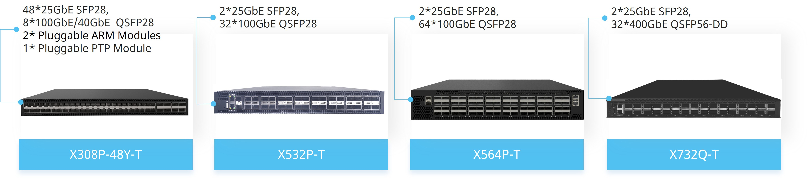

Table of Contents
   * [This Repository](#this_repository)
   * [About the Compatibilities to different SDE](#sde_compatibilities)
   * [Special Dependency](#sde_dependency)
   * [Quick Start](#quick_start)
   * [State Machine](#fsm)
   * [Q&A](#qa)

## <a name="this_repository"></a>This Repository

Mainline  **ALL-in-ONE** repository for all Intel Tofino based **X-T Programmable Bare Metal Switch** powered by Asterfusion with Long Term Support.

Disclaimer: The SDE for the Intel Tofino series of P4-programmable ASICs is currently only available under NDA from Intel. The users of this repository are assumed to be authorized to download and use the SDE.

Current supported **X-T Programmable Bare Metal Switch**:
  - `X732Q-T`,  32x 400GbE QSFP56-DD, and auxiliary 2x 25GbE SFP28 which support 1GbE.
  - `X564P-T`,  64x 100GbE QSFP28, and auxiliary 2x 25GbE SFP28 which support 1GbE.
  - `X532P-T`,  32x 100GbE QSFP28, and auxiliary 2x 25GbE SFP28 which support 1GbE.
  - `X312P-T`,  12x 100GbE QSFP28, 48x 25GbE SFP28, and auxiliary 2x 25GbE SFP28 which support 1GbE.
  - `X308P-T`,  08x 100GbE QSFP28, 48x 25GbE SFP28 and last 4 of them support 1GbE.



__Figure 1: X-T Programmable Bare Metal Switch Family__

Sometimes, we call `X564P-T` and `X532P-T` as `X5-T`, and call `X312P-T` and `X308P-T` as `X3-T`.

## <a name="sde_compatibilities"></a>About the Compatibilities to different SDE

Current supported **SDE**:

  - `8.9.x`.
  - `9.1.x`.
  - `9.3.x`.
  - `9.5.x`.
  - `9.7.x`.
  - `9.9.x`.
  - `9.11.x`.
  - `9.13.x`.

The version number of a SDE consists of three Arabic numbers, `x.y.z`, where `x` is the major version, `y` is the minor version, and `z` is the sub-version under `y`.
It's would be a LTS version when `y` is odd, otherwise it is a non-LTS version. It's worth mentioning that we build and run the code on the top of Debian and here only list the versions which we have adapted and tested, and this does not exclude or deny that the repository does not support other non-LTS SDE versions.

In order to be compatible with different SDE versions and different base systems, we have introduced two macro variables in the BSP, one is `SDE_VERSION` and the other is `OS_VERSION`.
They are defined in `$BSP/drivers/include/bf_pltfm_types/bf_pltfm_type.h`.

You can choose the most suitable mainline branch according to the following principle:
 - `master`.  Mainline branch for Debian `OS_VERSION 9`.
 - `master+`. Mainline branch for Debian `OS_VERSION 10`.

Then modify `SDE_VERSION` to which you're using.


## <a name="sde_dependency"></a>Special Dependency

There're some differences on hardware design between `X5-T` and `X3-T`. To this `all-in-one` repository, the full special dependencies are needed to be compiled and installed.

Here are the special dependencies:

  - `nct6779d`, which only required by `X312P-T`.
  - `cgoslx`, which required by `X5-T` (earlier HW).

Please install the dependencies from sources before trying bsp. You can find sources in [github](https://github.com/asterfusion).

## <a name="quick_start"></a>Quick Start

Intel Tofino SDK Variables

*x and y are appropriate values to fit your SDE.*
```
root@localhost:~# vi ~/.bashrc
export SDE=/root/bf-sde-9.x.y
export SDE_INSTALL=$SDE/install
export PATH=$PATH:$SDE_INSTALL/bin
export LD_LIBRARY_PATH=$LD_LIBRARY_PATH:$SDE_INSTALL/lib
root@localhost:# source ~/.bashrc
```
Clone bf-bsp-lts
```
root@localhost:~# git clone https://github.com/asterfusion/bf-bsp-lts.git
root@localhost:~# cd bf-bsp-lts
```

Optional Changes

*Do minor changes to fit your SDE if necessary.*
```
root@localhost:~/bf-bsp-lts# vi drivers/include/bf_pltfm_types/bf_pltfm_types.h +34
Modify SDE_VERSION  to value '990','9110','9120'or '9130' ...
root@localhost:~/bf-bsp-lts# vi ./configure.ac
Comment line 143 as since thrift is 0.14.1 there's no `_init` funciton.
```

Build and Install
```
root@localhost:~/bf-bsp-lts# rm -rf $SDE_INSTALL/include/bf_bd_cfg/ $SDE_INSTALL/include/bf_pltfm*
root@localhost:~/bf-bsp-lts# ./autogen.sh
root@localhost:~/bf-bsp-lts# ./configure --prefix=$SDE_INSTALL --enable-thrift
root@localhost:~/bf-bsp-lts# make -j7
root@localhost:~/bf-bsp-lts# make install
```

Finally, the `libasterfusionbf*`, `libplatform_thrift*`, `libpltfm_driver*`, `libpltfm_mgr*` will be installed to `$SDE_INSTALL/lib`, and all the header files exposed by bsp will be installed to `$SDE_INSTALL/include`.

To be highlighted, during the evolution of SDE, the installation paths of the third party dependencies have changed, so did the generated dependencies name. Thus a minor changes in bsp sources must be done to accommodate those changes. For SDE version equal with  or higher than `9.9.x`, the changes as following:
```
root@localhost:~# mkdir /usr/local/include
root@localhost:~# ln -s $SDE_INSTALL/include/thrift/ /usr/local/include/thrift
root@localhost:~# ln -s $SDE_INSTALL/lib/libtarget_sys.so $SDE_INSTALL/lib/libbfsys.so
```

Generate Configuration Variables
```
root@localhost:~# xt-cfgen.sh
It looks like x532p-t detected.
...
Generate /etc/platform.conf
Done
...
```

Launch ASIC
```
root@localhost:~# run_switchd.sh -p diag
Using SDE /usr/local/sde/bf-sde-9.x.y
Using SDE_INSTALL /usr/local/sde
Setting up DMA Memory Pool
Using TARGET_CONFIG_FILE /usr/local/sde/share/p4/targets/tofino/diag.conf
...
Install dir: /usr/local/sde (0x564634fa2140)
bf_switchd: system services initialized
bf_switchd: loading conf_file /usr/local/sde/share/p4/targets/tofino/diag.conf...
bf_switchd: processing device configuration...
Configuration for dev_id 0
...
```

## <a name="fsm"></a>State Machine


__Figure 2: QSFP/SFP State Machine__


## <a name="qa"></a>Q&A

More information or helps, please visit [Asterfusion](https://help.cloudswit.ch/portal/en/home).
